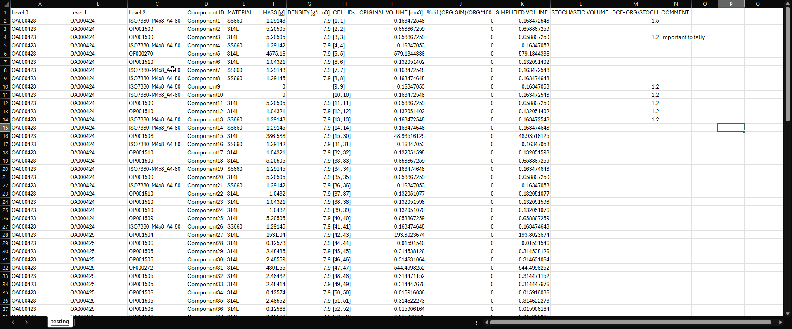
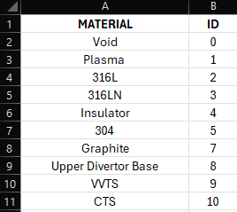
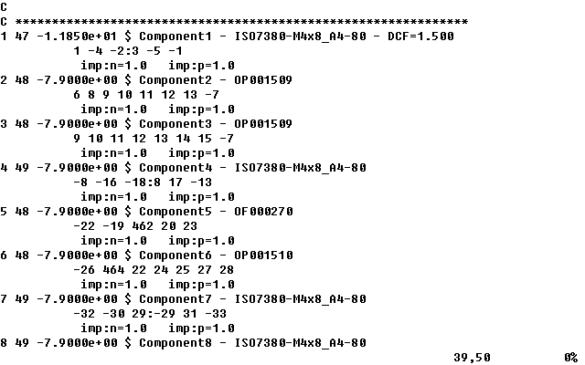

CSV workflow
============

The so called CSV workflow is a pipeline that streamlines and aids the process 
to convert a CAD model into an MCNP input file. It begins with the simplification of the
CAD in SpaceClaim and ends with the generation and pre-processing of the MCNP input file,
including the automatic assignation of materials, densities, density correction factors
and comments to the MCNP cells.

All the scripts in this workflow are centerd around a CSV file that contains all the
information of the model. This CSV file can be updated automatically via scripts and 
also be modified and filled by the user manually.

Pipeline
--------

#. The CAD model is cleaned by removing the clearly out of place components or clearly clashing geometry.
#. :ref:`Prepare CAD` is executed to generate a new SpaceClaim document where all the components are independent of each other and each has a unique ID.
#. :ref:`CSV generator` is executed to generate the CSV file.
#. The user performs the simplification of the model in SpaceClaim. During the simplification, the scritps :ref:`Detect volumes to adjust` and :ref:`Adjust volume` can be used to highlight and automatically adjust the components that exceed the maximum volume deviation.
#. The user fills in the CSV file with information regarding the materials and densities of the components. The Excel filtering features can be very beneficial in the manipulation and filling of the CSV. The script :ref:`Show by material` is very useful to study in SpaceClaim the material distribution among the components.
#. :ref:`CSV generator` is executed one last time to update the CSV with the final simplified volume information. 
#. :ref:`Save STEP` is executed to save the CAD model as a STEP file in a way that the MCNP cell IDs will match the order of the CAD components.
#. The conversion of the previous STEP file to an MCNP input file is performed with another tool like GEOUNED.
#. :ref:`MCNP materials from CSV` is executed to update the MCNP file with the materials, densities, density correction factors and component names from the CSV file.

Prepare CAD
-----------

This script is run in SpaceClaim and doesn't require any input from the user.
It prepares the CAD model for the workflow. It makes all the components 
independent of each other. Repeated instances of the same component (e.g. a bolt) will
become unique. In addition, all the bodies of a component will be assigned to a new 
component one level deeper in the assembly hierarchy, the component name will have the 
form **ComponentX** where **X** is a number, a unique identifier.

.. image:: _static/prepare_cad_hierarchy.png
   :alt: Effect of the prepare_cad script on the assembly hierarchy.
   :align: center
   :width: 95%

.. attention::

    This script is meant to be run only once. Running this script is a necessary step 
    to later run the :ref:`CSV generator` script.

.. tip::

    It is recommended to *clean* the model before running this script to remove the 
    clearly wrong or out of place components. This will avoid deleting a lot of components
    later and therefore have a lot of jumps between the component identifiers (the
    **X** in **ComponentX**). 

.. warning::

    By making all the components independent of each other, it may become more difficult
    to apply the same changes to all the instances of a component that appears many times.
    The use of the **Power Selection** features in SpaceClaim can greatly mitigate this
    tradeoff. 

CSV generator
-------------

This script is run in SpaceClaim and doesn't require any input from the user. The first
time it is executed, it generates a new CSV file with the same name as the CAD file and 
located in the same folder. The CSV file will contain information read from the model.  

* The columns **Level X** show the component hierarchy.
* **Component ID** show the unique identifier of the component.
* **MATERIAL** shows the name of the component's material (initially empty).
* **MASS [g]** shows the mass of the component (initially empty).
* **DENSITY [g/cm3]** shows the density of the material's component (initially empty).
* **CELL IDs** shows the range of the MCNP cell IDs that will be assigned to the component. More than one indicates multiple bodies in the CAD component.
* **DENSITY CORRECTION FACTOR** shows the density correction factor that will be applied to the density of the material's component (initially empty).
* **ORIGINAL VOLUME [cm3]** shows the volume of the component at the time of the first CSV generation.
* **%dif (ORG-SIM)/ORG*100** shows the percentage difference between the original volume and the current volume (initially empty).
* **SIMPLIFIED VOLUME** shows the current volume of the component (initially empty).
* **STOCHASTIC VOLUME** shows the volume of the component as calculated with an MPNC simulation (initially empty).
* **DCF=ORG/STOCH** shows the density correction factor (if any) to be applied (initially empty).
* **COMMENT** shows any comments that the user wants to add to the component (initially empty).

When the script is executed for the first time, only the **Level X**, **Component ID**, **CELL IDs** and **ORIGINAL VOLUME[cm3]** will be automatically filled.
In subsequent runs of the script the **SIMPLIFIED VOLUME** column will be update as well as the **Level X** columns.
The rest of the columns are meant to be filled by the user, possibly with the help of Excel features.

After running the script for the first time the user may delete components in SpaceClaim,
they will still appear in the CSV file but with a *DELETED* keyword appearing in the 
**CELL IDs** column. The user may also add new components to the model, but they should 
follow the same naming convention of **ComponentX**. Components can be reorderd in the 
hierarchy as long as the Component ID is maintained. It is possible to manually edit values
that are suposed to be automatically filled like the original volume (e.g. it is decided
a posteriori that the correct volume of a component is different).

This CSV will be used in all the other scripts of the workflow proving to be a very 
valuable asset during the development of a MCNP model.

.. attention::

    Before running this script the CAD shoudl have been prepared with the
    :ref:`Prepare CAD` script.

.. warning::

    To run the script for a second time or more, the CSV file should be present in the 
    same folder as the CAD and have the same name. The script will overwrite the CSV
    file and therefore the CSV file should not be open in any other program like Excel.

Detect volumes to adjust
------------------------

This script is run in SpaceClaim, it requires the CSV file generated with :ref:`CSV generator`.
The tool highlights the components that exceed a maximum volume deviation from the 
original volume that appears in the CSV. Components that exceed the limit will be colored in opaque red.
To easily spot the red components, all the other components which comply with the volume
requirements will be colored with a transparent blue.

.. raw:: html

   

     <video style="width: 95%; max-width: 1080px;" controls autoplay loop muted>
       <source src="_static/SpaceClaim_detect_volumes_to_adjust.mp4" type="video/mp4">
       Your browser does not support the video tag.
     </video>
   

.. note::

    The default maximum volume deviation is 1%. The user can modify this value as 
    explained in :ref:`Edit the parameter of a published tool`.

.. tip::

    This script synergizes extremely well with :ref:`Adjust volume`. The two in combination
    make complying with volume requirements an almost trivial process. 

Adjust volume
-------------

This script is run in SpaceClaim, it requires the CSV file generated with :ref:`CSV generator`.
This tool automatically extrude a face/s of a component to match the volume of the component 
to the one in the CSV file. The faces will be extruded in the correct direction until
the current volume falls inside a maximum volume deviation.

To execute the tool, the user must first select the face/s of the component that will be
extruded and the run the script. After the script is executed, the component will be 
colored with a transparent blue.

.. raw:: html

   

     <video style="width: 95%; max-width: 1080px;" controls autoplay loop muted>
       <source src="_static/SpaceClaim_adjust_volume.mp4" type="video/mp4">
       Your browser does not support the video tag.
     </video>
   

.. warning::
    
    If the extrusion of a face is so much that it makes the face dissappear, the script 
    execution will fail. The user must select the faces considering this possibility.

    The user should be aware of the possible new geometry clashes that may arise after 
    the face/s extrusion to select the most appropiate faces.

.. tip::

    This script synergizes extremely well with :ref:`Adjust volume`. As the color of the
    adjusted components matches those colored with *Adjust volume*, the process is 
    stramlined.

Show by material
----------------

This script is run in SpaceClaim, it requires the CSV file generated with :ref:`CSV generator`.
This tool allows the user to select a set of materials and display only the components
that are made of those materials as read form the CSV file (the **MATERIAL** column).  
When executing the script, a new window will pop up with a list of all the materials.
The user can select one or more materials and click on the **Finish** button to display
them.

.. raw:: html

   

     <video style="width: 95%; max-width: 1080px;" controls autoplay loop muted>
       <source src="_static/SpaceClaim_show_by_material.mp4" type="video/mp4">
       Your browser does not support the video tag.
     </video>
   

.. note::

    The **MATERIAL** column of the CSV file is meant to be filled by the user. This 
    tool is very useful along that process. If no material has been specified yet for
    a component, it will be able to be selected as *No material specified*.

Save STEP
---------

This script is run in SpaceClaim, it requires the CSV file generated with :ref:`CSV generator`.
This tool saves the CAD model as a STEP file a way that the MCNP cell IDs after the conversion
with a tool like GEOUNED will match the order of the CSV file components.

MCNP materials from CSV
-----------------------

This script is run in a CPython environment, it requires the MCNP input, the CSV file and,
optionally, a file **named materials_ids.csv**.
This tool updates the MCNP file with the materials, densities, density correction factors
and component names from the CSV file.

The **named materials_ids.csv** file is a CSV file that contains the correspondence between
the material names in the CSV file and the material IDs in the MCNP file. The file should
have the following columns: **MATERIAL**, **ID**. The **MATERIAL** column contains the 
material names as they appear in the CSV file and the **ID** column contains the number 
that will be used in the MCNP file to identify that material. If the file **materials_ids.csv** 
is not present, or if a material is not found in the file, the script will automatically
assign a new material ID. After the script is executed, the materials used in the model and their respective IDs
will be printed in the console.

.. note::

    The user can specify void cells in the CSV file by using the material name *Void*.

At the top of the script there are some constant variables that need to be specified by
the user: **MCNP_INPUT_FILEPATH**, **CSV_FILEPATH**, **MATERIAL_IDS_FILEPATH** and
**FIRST_CELL_ID**. The first three are the paths to the MCNP input file, the CSV file and
the **materials_ids.csv** file. The last one is the first cell ID number of the model in
the MCNP input file. This is necessary as in the CSV file the **CELL IDs** column always
start with 1.

The execution of this script generates a new MCNP file with the same name but with 
the suffix **[materials_added]**. The changes perfomed to the file are:

#. The material IDs are assigned to the MCNP cells.
#. The densities are assigned to the MCNP cells after being multiplied by their density correction factor (if any).
#. A comment is added to the first line of the cell with:
    
    #. The component ID.
    #. The name of the component as seen in the last non empty **Level X** column.
    #. The density correction factor employed (if any).

