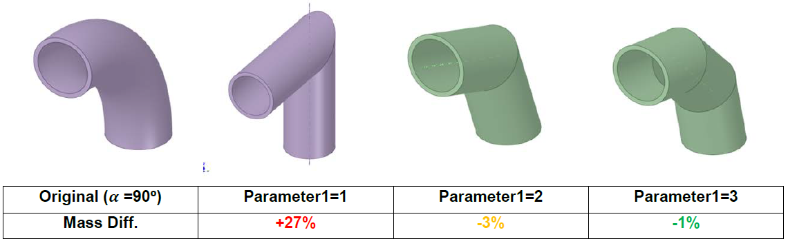

Miscellaneous
=============

Each of these scripts performs a single task independently, they are not part of any 
specific workflow.

Elbow to cylinder
-----------------

Work in progress. 

Detect torus
------------

This script is run in SpaceClaim and doesn't require any input from the user.
It highlights all the bodies (in opaque yellow) that contain a toroidal surface (in 
opaque red). All the other bodies are made blue transparent. If no toroidal surface is 
found, a message window will pop up and no color modifications will be made.

.. raw:: html

   

     <video style="width: 95%; max-width: 1080px;" controls autoplay loop muted>
       <source src="_static/SpaceClaim_detect_torus.mp4" type="video/mp4">
       Your browser does not support the video tag.
     </video>
   

FMESH tally generator
---------------------

This script is run in SpaceClaim, drag and drop the file and run it by clicking on the 
green arrow button after selecting a body and run the script to get its related MCNP FMESH and TR cards.
The body should be a prism: 6 reactangular and orthogonal faces.

.. raw:: html

   

     <video style="width: 95%; max-width: 1080px;" controls autoplay loop muted>
       <source src="_static/SpaceClaim_fmesh_tally_generator.mp4" type="video/mp4">
       Your browser does not support the video tag.
     </video>
   

Load CSV points
---------------

This script is run in SpaceClaim.It loads a CSV file with the coordinates of points as
spheres.
It assumes that the first three columns of the .csv are X, Y, Z coordinates.
The user should modify the input parameters directly on the script file.

.. raw:: html

   

     <video style="width: 95%; max-width: 1080px;" controls autoplay loop muted>
       <source src="_static/SpaceClaim_load_csv_points.mp4" type="video/mp4">
       Your browser does not support the video tag.
     </video>
   

Simplify toroidal profiles
--------------------------

This script is run in SpaceClaim.
Enter into section mode and select the whole section of a body with toroidal profiles.
The curves will be substituted by straight lines with a given angle between them.
Then the new profile can be extruded to create a new body composed only of conical and
cylindrical surfaces.

.. raw:: html

   

     <video style="width: 95%; max-width: 1080px;" controls autoplay loop muted>
       <source src="_static/SpaceClaim_simplify_toroidal_profile.mp4" type="video/mp4">
       Your browser does not support the video tag.
     </video>
   

